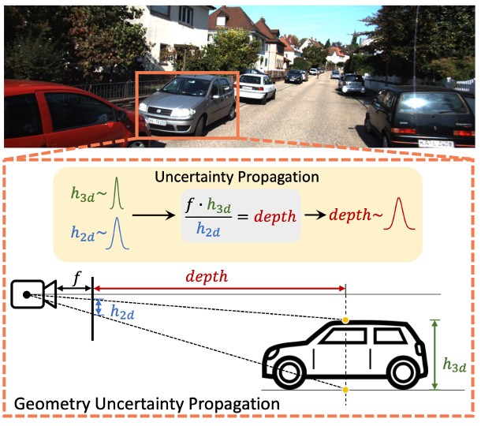

# GUPNet++

This is the official implementation of "GUPNet++: Geometry Uncertainty Propagation Network for Monocular 3D Object Detection".

## citation

If you find our work useful in your research, please consider citing:

    @article{lu2024gupnet++,
    title={Gupnet++: geometry uncertainty propagation network for monocular 3D object detection},
    author={Lu, Yan and Ma, Xinzhu and Yang, Lei and Zhang, Tianzhu and Liu, Yating and Chu, Qi and He, Tong and Li, Yonghui and Ouyang,  Wanli},
    journal={IEEE Transactions on Pattern Analysis and Machine Intelligence},
    year={2024},
    publisher={IEEE}
    }
    @article{lu2021geometry,
    title={Geometry Uncertainty Projection Network for Monocular 3D Object Detection},
    author={Lu, Yan and Ma, Xinzhu and Yang, Lei and Zhang, Tianzhu and Liu, Yating and Chu, Qi and Yan, Junjie and Ouyang, Wanli},
    journal={arXiv preprint arXiv:2107.13774},year={2021}}

## Usage 

### Installation

This project is based on [mmdetection3d repository](https://github.com/open-mmlab/mmdetection3d). You can refer to the original mmdetection3d README to install the requirements [English](MMDET_README.md) | [简体中文](MMDET_README_zh-CN.md). Here we provide our accurate steps corresponding to our experiment environments with specific version packages:

1. install mmcv

        pip install mmcv-full==1.6.0

2. install mmdetection

        git clone https://github.com/open-mmlab/mmdetection.git
        cd mmdetection
        git checkout v2.24.0  # switch to v2.24.0 branch (2.25.0 is also ok)
        pip install -r requirements/build.txt
        pip install -v -e .  #
        cd ..

3. install mmsegmentaion

        pip install mmsegmentation==0.26.0

4. install mmdetection3d (current repo)

        git clone https://github.com/SuperMHP/GUPNet_Plus.git
        cd GUPNet_Plus
        pip install -v -e .

5. Downloading datasets. 

    [KITTI](http://www.cvlibs.net/datasets/kitti/eval_object.php?obj_benchmark=3d), including left color images, camera calibration matrices and training labels. 

    [NuScenes](https://www.nuscenes.org/nuscenes#download), including Mini, Trainval, Test of Full dataset (v1.0).

6. Putting the datasets as following directory

    updating in recent days.

### Train

#### GUPNet++

KITTI training for evaluation set

    # PyTorch DDP
    CUDA_VISIBLE_DEVICES=0,1,2,3 bash tools/dist_train.sh configs/gupnet_plus/gupnet_plus_dla34_kitti.py

    # Slurm
    GPUS=4 GPUS_PER_NODE=4 bash tools/slurm_train.sh YOUR_PARTITION_NAME configs/gupnet_plus/gupnet_plus_dla34_kitti.py

KITTI training for test set 

    # PyTorch DDP
    CUDA_VISIBLE_DEVICES=0,1,2,3 bash tools/dist_train.sh configs/gupnet_plus/gupnet_plus_dla34_kitti_trainval.py

    # Slurm
    GPUS=4 GPUS_PER_NODE=4 bash tools/slurm_train.sh YOUR_PARTITION_NAME configs/gupnet_plus/gupnet_plus_dla34_kitti_trainval.py

NuScenes training for evaluation set (DLA34)

    # PyTorch DDP
    CUDA_VISIBLE_DEVICES=0,1,2,3,4,5,6,7 bash tools/dist_train.sh configs/gupnet_plus/gupnet_plus_dla34_nuscenes.py

    # Slurm
    GPUS=8 GPUS_PER_NODE=8 bash tools/dist_train.sh configs/gupnet_plus/gupnet_plus_dla34_nuscenes.py
    
NuScenes training for evaluation set (HGLS104)

    # PyTorch DDP
    ## node 1
    MASTER_ADDR=YOUR_MASTER_ADDR NNODES=2 NODE_RANK=0 CUDA_VISIBLE_DEVICES=0,1,2,3,4,5,6,7 bash tools/dist_train.sh configs/gupnet_plus/gupnet_plus_hgls104_nuscenes.py
    ## node 2
    MASTER_ADDR=YOUR_MASTER_ADDR NNODES=2 NODE_RANK=1 CUDA_VISIBLE_DEVICES=0,1,2,3,4,5,6,7 bash tools/dist_train.sh configs/gupnet_plus/gupnet_plus_hgls104_nuscenes.py

    # Slurm
    GPUS=16 GPUS_PER_NODE=8 bash tools/dist_train.sh configs/gupnet_plus/gupnet_plus_hgls104_nuscenes.py
### Test

updating in recent days.

## Contact

If you have any question about this project, please feel free to contact yan.lu1@sydney.edu.au or luyan@pjlab.org.cn.
